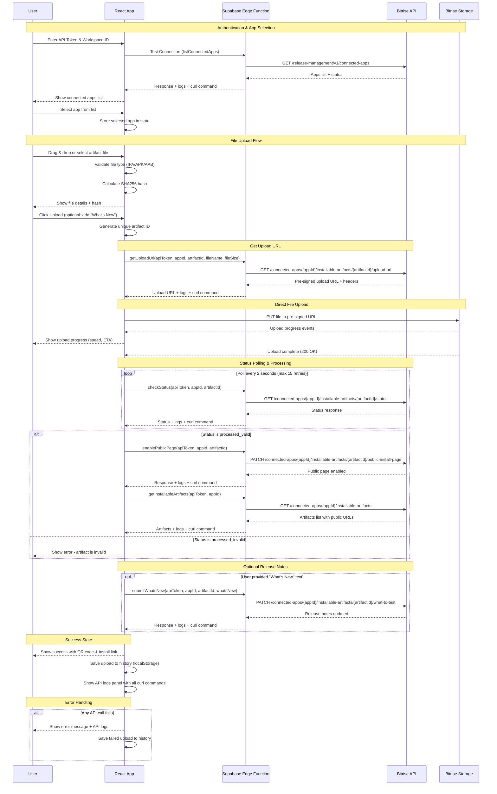

# Bitrise Artifact Uploader


This open-source project is a web-based tool for uploading mobile application artifacts (IPA, APK, and AAB files) to Bitrise Release Management. It provides a simple and intuitive interface for selecting your Bitrise app and uploading new builds.

The application uses a Supabase Edge Function (`bitrise-proxy`) to securely communicate with the Bitrise API, ensuring that your API tokens are never exposed on the client-side.

## Features

-   Securely connect to your Bitrise account using an API token and workspace ID.
-   List and select from your available Bitrise applications.
-   Drag-and-drop or browse to upload your `.ipa`, `.apk`, or `.aab` files.
-   View a history of your recent uploads.
-   See detailed API logs for debugging purposes.

## Sequence Diagram



## Getting Started

To run this project locally, you'll need Node.js and npm installed.

```sh
# Step 1: Clone the repository.
git clone <YOUR_GIT_URL>

# Step 2: Navigate to the project directory.
cd <YOUR_PROJECT_NAME>

# Step 3: Install the necessary dependencies.
npm i

# Step 4: Start the development server.
npm run dev
```

The development server will start, and you can access the application in your browser, usually at `http://localhost:8080`.

## Configuration

Before starting the development server, you need to set up your environment variables.

1.  **Create a `.env` file:** Copy the `.env.example` file to a new file named `.env`.

    ```sh
    cp .env.example .env
    ```

2.  **Add your Supabase credentials:** Open the `.env` file and replace the placeholder values with your Supabase project's credentials. You can find these in your Supabase project's "API" settings.

    ```
    VITE_SUPABASE_PROJECT_ID="your-project-id"
    VITE_SUPABASE_PUBLISHABLE_KEY="your-publishable-key"
    VITE_SUPABASE_URL="https://your-project-id.supabase.co"
    ```

## Deploying Supabase Edge Functions

This project requires the `bitrise-proxy` Edge Function to be deployed to your Supabase project to handle Bitrise API requests securely.

1.  **Install the Supabase CLI:**

    ```sh
    npm i supabase --save-dev
    ```

2.  **Update the Supabase config file:** Open `supabase/config.toml` and replace the placeholder `project_id` with your actual Supabase project ID.

3.  **Link your Supabase project:**

    ```sh
    npx supabase link --project-ref <PROJECT_ID>
    ```

3.  **Set your Supabase access token:** You will need to provide a `SUPABASE_ACCESS_TOKEN` with `owner` or `admin` permissions for the CLI to deploy the function.

    ```sh
    export SUPABASE_ACCESS_TOKEN=<YOUR_ACCESS_TOKEN>
    ```

4.  **Deploy the Edge Function:**

    ```sh
    npx supabase functions deploy --no-verify-jwt bitrise-proxy bitrise-upload
    ```

After completing these steps, the `bitrise-proxy` & `bitrise-upload` functions will be ready to handle API requests.

## Technologies Used

This project is built with:

-   Vite
-   TypeScript
-   React
-   shadcn-ui
-   Tailwind CSS
-   Supabase (for Edge Functions)

## Security Note

If you have accidentally committed your `.env` file to the repository, you should take immediate action to remove it from the Git history. Even after you delete the file and update your `.gitignore`, the file will still exist in the commit history. You can use a tool like `git-filter-repo` to permanently remove the file from your repository's history.

## License

Bitrise Artifact Uploader is released under the [MIT license](LICENSE). Feel free to use, modify, and distribute it as you wish. 

## Support

If you like this project you can [buy me a coffee](https://www.buymeacoffee.com/hanis).

<a href="https://www.buymeacoffee.com/hanis" target="_blank"></a>